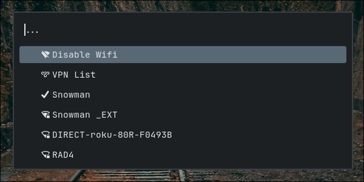

# rofi-wifi-script
A script that allows Wifi networks to be displayed and controlled in rofi


## Features
- Toggle wifi on/off 
- Connect/disconnect and forget networks
- Enable/disable auto-connect for networks 
- See currently connected network 
- Enable/disable Wireguard VPNs added to NetworkManager (optional)
## Dependencies 
- Rofi
- NetworkManager 
- Libnotify
- Nerd fonts (for icons)
## Setup
- Install dependencies  
- ```bash 
    git clone  https://github.com/aelsadi/rofi-wifi-script.git
    cd rofi-wifi-script
    bash "./script.sh" #use 'bash ./script_with_vpn_list.sh' for vpn list 
    ```
- Optional: add to $Path to allow it to be called from anywhere
## Limitations
- Only basic information is available
- No hotspot creation
